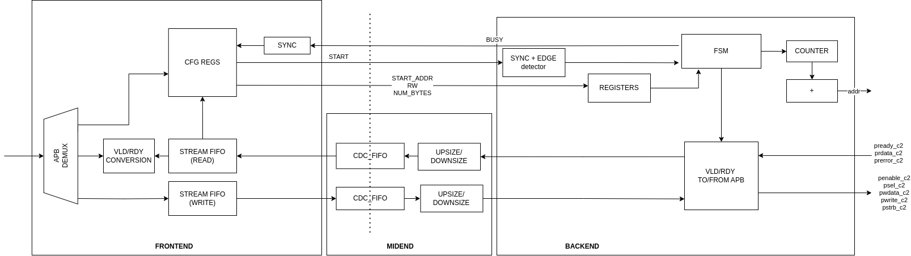
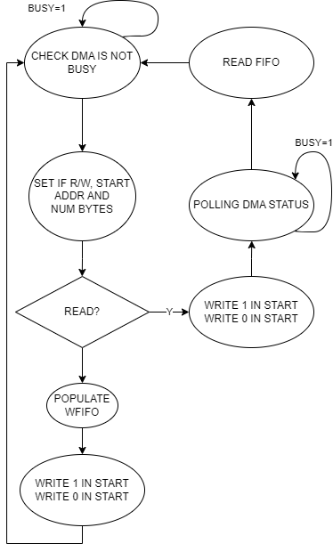

# APB DMA

This repository hosts an APB-compliant DMA. The DMA provides two APB ports, one master and one slave, of configurable data and address widths.
An additional parameter is `ASYNC` with which the user can select whether they want to have the two APB ports operating in two different clock domains.

The repository is organized as follows:

 * `src` includes the source sv files, excluding the 3rd party libraries
 * `include` contains very few defines
 * `docs` contains diagrams
 * `fe` contains the timing constraints

The overall architecture of the DMA is the one available below:

It is divided in 3 parts, the front-end, the mid-end and the back-end.

## Front-end

The front-end exposes the APB slave port and accepts read and write transactions over the APB bus. The resulting memory map is described below:

### Memory Map

| Name  | BitWidth  | Addr | Access | Description |
|--|--|--|--|--|
| Start Address | APB_SLV_DW | 0 | Read/Write |Stores the starting address of a transaction |
| Number of bytes | 8 | APB_SLV_DW / 8| Read/Write | Store the number of bytes to transfer|
| Read or write | 1 | 2 * APB_SLV_DW / 8| Read/Write | Signals if the desired transaction is read or write |
| Start | 1 | 3 * APB_SLV_DW / 8| Read/Write | Set to 1 to kick-off a transaction |
| Read Fifo Usage | 8 | 4 * APB_SLV_DW / 8| Read only | Signals how many valid data are stored in the Read FIFO |
| Busy | 1 | 5 * APB_SLV_DW / 8| Read only | Signals if the backend is busy |
| Write FIFO | APB_SLV_DW | 6 * APB_SLV_DW / 8| Write only | Write to the write FIFO |
| Read FIFO | APB_SLV_DW | 7 * APB_SLV_DW / 8| Read only | Read from the read FIFO |

### Protocol

To issue a read or write DMA transaction, an APB master has to follow the procedure described in the flow diagram below:

## Mid-end

The mid-end is the interface between the front-end and the back-end.
It performs the clock domain crossing of the read and write data payloads, when needed.

Furthermore, it is in charge of the datawidths conversion, since APB_SLV_DW and APB_MST_DV can be different.
The conversion happens in the clock domain of the backend.

## Back-end

The back-end implements a simple FSM, which detects when a transaction is issued at the front-end and then connects the valid ready interface provided by the mid-end into APB transactions, and it computes the output address according to  

## Known-limitations

There are two main known limitations at the moment, which are check by [assertions in the configuration registers at simulation time](./src/apbdma_cfg_regs.sv#L110-L118): the issued transactions have to be aligned to the bigger data width, either the one of the master or the one of the slave. This applies to the starting address and the number of bytes to be sent.

## Synthesis details

An example of timing constraints for when `ASYNC=1` can be found in the [`fe/constraints.sdc`](./fe/constraints.sdc) file. 

## 3rd-party IPs

3rd party IPs are downloaded by executing the `make file_list.txt` command, which will downloaded the libraries in the folder `.bender/git/checkouts/` and generate a list of all the files to compile.
In particular, the main IPs borrowed from open-source libraries are the following:

 * [`apb_demux`](https://github.com/pulp-platform/apb/blob/master/src/apb_demux.sv)

 * [`addr_decode`](https://github.com/pulp-platform/common_cells/blob/master/src/addr_decode.sv)

 * [`cdc_stream_fifos`](https://github.com/pulp-platform/common_cells/blob/master/src/cdc_fifo_gray.sv)

 * [`synchronizer`](https://github.com/pulp-platform/common_cells/blob/master/src/sync_wedge.sv)

 * [Defines to instante FFs](https://github.com/pulp-platform/common_cells/blob/master/include/common_cells/registers.svh)